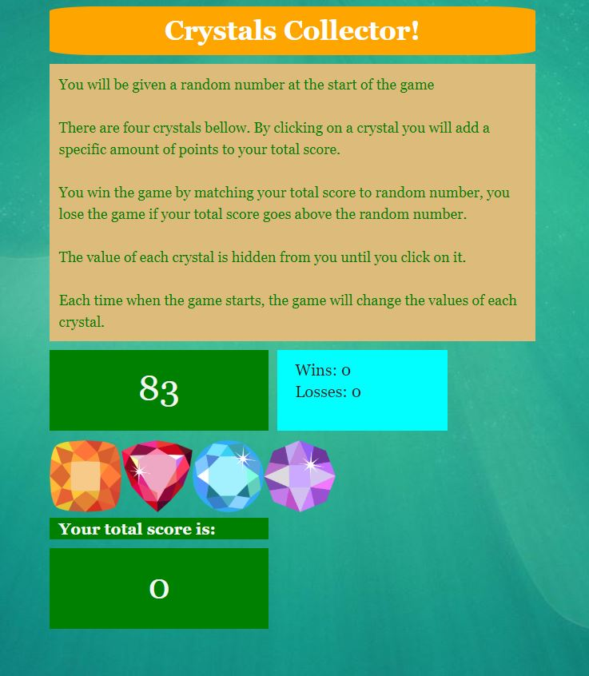

# Crystal-Collector
Crystals Collector Game

This game displays four crystals as buttons on the page. The player should use the crystals to match the random number shown.

  * Each crystal has a random hidden value between 1 - 12.

  * The player will be shown a random number at the start of the game.

  * When the player clicks on a crystal, it will add a specific amount of points to the player's total score. 

  * The player wins if their total score matches the random number from the beginning of the game.

  * The player loses if their score goes above the random number.

  * The game restarts whenever the player wins or loses.

  * The app shows the number of games the player wins and loses. 
  
Link to GitHub pages: https://boki23m.github.io/Crystal-Collector/

